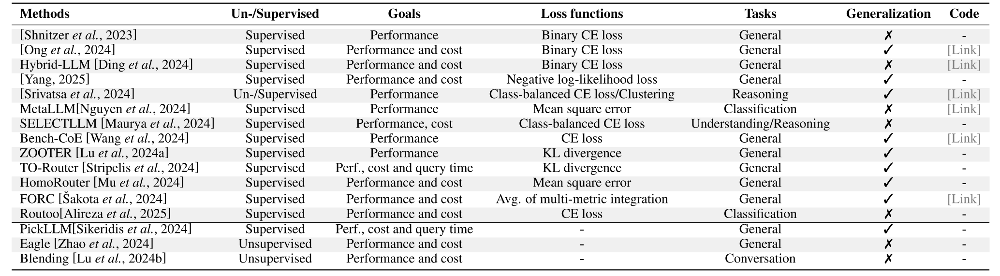

# 2. Papers

## 2.1 Ensemble Before Inference

Figure 3:  Summary analysis of the key attributes of ensemble-before-inference methods.  (Please note that this table may not be fully updated to include all the papers listed below.)

### 2.1.1 (a,1) Pre-Trained Router

- **LLM Routing with Benchmark Datasets.** (2023)  
&nbsp;&nbsp;&nbsp;&nbsp;&nbsp;&nbsp;&nbsp;&nbsp;&nbsp;&nbsp;Name: -, Code: -

- **✅ RouteLLM: Learning to Route LLMs with Preference Data.** (2024)  
&nbsp;&nbsp;&nbsp;&nbsp;&nbsp;&nbsp;&nbsp;&nbsp;&nbsp;&nbsp;Name: RouteLLM, 

- **✅ Hybrid LLM: Cost-Efficient and Quality-Aware Query Routing.** (2024)  
&nbsp;&nbsp;&nbsp;&nbsp;&nbsp;&nbsp;&nbsp;&nbsp;&nbsp;&nbsp;Name: Hybrid-LLM, 

- **✅ LLM Bandit: Cost-Efficient LLM Generation via Preference-Conditioned Dynamic Routing.** (2025)  
&nbsp;&nbsp;&nbsp;&nbsp;&nbsp;&nbsp;&nbsp;&nbsp;&nbsp;&nbsp;Name: -, Code: -

- **Harnessing the Power of Multiple Minds: Lessons Learned from LLM Routing.** (2024)  
&nbsp;&nbsp;&nbsp;&nbsp;&nbsp;&nbsp;&nbsp;&nbsp;&nbsp;&nbsp;Name: -, 

- **✅ MetaLLM: A High-performant and Cost-efficient Dynamic Framework for Wrapping LLMs.** (2024)  
&nbsp;&nbsp;&nbsp;&nbsp;&nbsp;&nbsp;&nbsp;&nbsp;&nbsp;&nbsp;Name: MetaLLM, 

- **SelectLLM: Query-Aware Efficient Selection Algorithm for Large Language Models.** (2024)  
&nbsp;&nbsp;&nbsp;&nbsp;&nbsp;&nbsp;&nbsp;&nbsp;&nbsp;&nbsp;Name: SelectLLM, Code: -

- **Bench-CoE: a Framework for Collaboration of Experts from Benchmark.** (2024)  
&nbsp;&nbsp;&nbsp;&nbsp;&nbsp;&nbsp;&nbsp;&nbsp;&nbsp;&nbsp;Name: Bench-CoE, 

- **Routing to the Expert: Efficient Reward-guided Ensemble of Large Language Models.** (2023)  
&nbsp;&nbsp;&nbsp;&nbsp;&nbsp;&nbsp;&nbsp;&nbsp;&nbsp;&nbsp;Name: ZOOTER, Code: -

- **GraphRouter: A Graph-based Router for LLM Selections** (2024)  
&nbsp;&nbsp;&nbsp;&nbsp;&nbsp;&nbsp;&nbsp;&nbsp;&nbsp;&nbsp;Name: GraphRouter, Code: -

- **✅ TensorOpera Router: A Multi-Model Router for Efficient LLM Inference.** (2024)  
&nbsp;&nbsp;&nbsp;&nbsp;&nbsp;&nbsp;&nbsp;&nbsp;&nbsp;&nbsp;Name: TO-Router, Code: -

- **Query Routing for Homogeneous Tools: An Instantiation in the RAG Scenario.** (2024)  
&nbsp;&nbsp;&nbsp;&nbsp;&nbsp;&nbsp;&nbsp;&nbsp;&nbsp;&nbsp;Name: HomoRouter, Code: -

- **❌ Fly-Swat or Cannon? Cost-Effective Language Model Choice via Meta-Modeling.** (2023)  
&nbsp;&nbsp;&nbsp;&nbsp;&nbsp;&nbsp;&nbsp;&nbsp;&nbsp;&nbsp;Name: FORC, 

- **✅ Routoo: Learning to Route to Large Language Models Effectively.** (2024)  
&nbsp;&nbsp;&nbsp;&nbsp;&nbsp;&nbsp;&nbsp;&nbsp;&nbsp;&nbsp;Name: Routoo, Code: -

- **(Newly added paper, March 2025:) ✅ RouterDC: Query-Based Router by Dual Contrastive Learning for Assembling Large Language Models.** (2024)  
&nbsp;&nbsp;&nbsp;&nbsp;&nbsp;&nbsp;&nbsp;&nbsp;&nbsp;&nbsp;Name: RouterDC, 

- **(Newly added paper, May 2025:) ❌ Rethinking Predictive Modeling for LLM Routing: When Simple kNN Beats Complex Learned Routers.** (2025)  
&nbsp;&nbsp;&nbsp;&nbsp;&nbsp;&nbsp;&nbsp;&nbsp;&nbsp;&nbsp;Name: -, Code: -

- **(Newly added paper, May 2025:) InferenceDynamics: Efficient Routing Across LLMs through Structured Capability and Knowledge Profiling.** (2025)  
&nbsp;&nbsp;&nbsp;&nbsp;&nbsp;&nbsp;&nbsp;&nbsp;&nbsp;&nbsp;Name: InferenceDynamics, Code: -

- **(Newly added paper, May 2025:) CO-OPTIMIZING RECOMMENDATION AND EVALUATION FOR LLM SELECTION.** (2025)  
&nbsp;&nbsp;&nbsp;&nbsp;&nbsp;&nbsp;&nbsp;&nbsp;&nbsp;&nbsp;Name: RELM, Code: -

- **(Newly added paper, May 2025:) ❌ Route to Reason: Adaptive Routing for LLM and Reasoning Strategy Selection.** (2025)  
&nbsp;&nbsp;&nbsp;&nbsp;&nbsp;&nbsp;&nbsp;&nbsp;&nbsp;&nbsp;Name: RTR, 

- **(Newly added paper, June 2025:) RadialRouter: Structured Representation for Efficient and Robust Large Language Models Routing.** (2025)  
&nbsp;&nbsp;&nbsp;&nbsp;&nbsp;&nbsp;&nbsp;&nbsp;&nbsp;&nbsp;Name: RadialRouter, Code: -

- **(Newly added paper, June 2025:) TAGROUTER: Learning Route to LLMs through Tags for Open-Domain Text Generation Tasks.** (2025)  
&nbsp;&nbsp;&nbsp;&nbsp;&nbsp;&nbsp;&nbsp;&nbsp;&nbsp;&nbsp;Name: TagRouter, Code: -

### 2.1.2 (a,2) Non pre-trained router

- **PickLLM: Context-Aware RL-Assisted Large Language Model Routing.** (2024)  
&nbsp;&nbsp;&nbsp;&nbsp;&nbsp;&nbsp;&nbsp;&nbsp;&nbsp;&nbsp;Name: PickLLM, Code: -

- **Eagle: Efficient Training-Free Router for Multi-LLM Inference.** (2024)  
&nbsp;&nbsp;&nbsp;&nbsp;&nbsp;&nbsp;&nbsp;&nbsp;&nbsp;&nbsp;Name: Eagle, Code: -

- **Blending Is All You Need: Cheaper, Better Alternative to Trillion-Parameters LLM.** (2024)  
&nbsp;&nbsp;&nbsp;&nbsp;&nbsp;&nbsp;&nbsp;&nbsp;&nbsp;&nbsp;Name: Blending, Code: -

- **(Newly added paper, June 2025:) ✅ The Avengers: A Simple Recipe for Uniting Smaller Language Models to Challenge Proprietary Giants.** (2025)  
&nbsp;&nbsp;&nbsp;&nbsp;&nbsp;&nbsp;&nbsp;&nbsp;&nbsp;&nbsp;Name: Avengers, 
